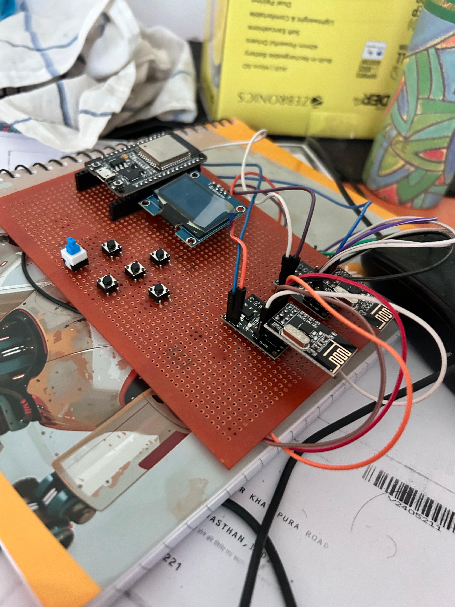

# Radio Network Testing Console



## Overview

Radio Network Testing Console is an ESP32-based 2.4 GHz wireless testing device designed for learning, experimentation, and authorized network-device testing.

This project uses an **ESP32** and **NRF24L01** module to help test and study wireless devices operating in the 2.4 GHz band, such as:

- Wi-Fi devices
- Bluetooth devices
- BLE devices
- NRF24L01-based devices
- Other 2.4 GHz wireless modules

> This project is intended only for educational use, lab testing, and authorized security research.

## Purpose

The goal of this project is to provide a compact console-style device for testing and analyzing 2.4 GHz wireless environments.

It can be used to understand how nearby wireless devices behave, test device resilience in a controlled lab setup, and explore basic RF/network concepts using ESP32 and NRF24L01 hardware.

## Hardware Used

- ESP32 development board
- NRF24L01 2.4 GHz transceiver module
- Display module
- Buttons or controls
- Battery or USB power supply
- Custom console enclosure

## Supported Testing Area

This project focuses on the **2.4 GHz frequency range**, commonly used by:

- Wi-Fi 2.4 GHz networks
- Bluetooth and BLE devices
- NRF24L01 wireless communication
- IoT devices using 2.4 GHz radio modules

## Important Notice

Use this device only on networks and devices that you own or have permission to test.

Do not use this project to disrupt, interfere with, or attack public or private wireless networks. Unauthorized interference with wireless communication may be illegal in many countries.

## Project Image

The console image is stored in the root directory of this repository:
##  Repository structure
```text

console.jpeg
Radio-game-console/
├── console.jpeg
├── README.md
├── src/
├── include/
├── lib/
```
└── platformio.ini
